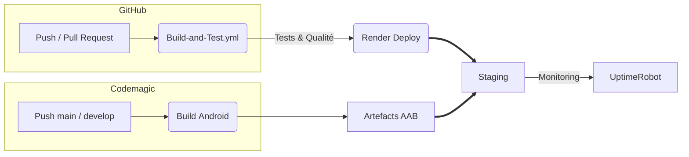

# 📦 Plany – CI/CD & DevOps Guide

> _Ce README décrit la chaîne d’intégration et de déploiement continu (CI/CD) du projet **Plany** — backend Nest.js & application mobile Flutter _

---

## 🚀 Table des matières

1. [Objectifs & périmètre](#-objectifs--périmètre)
2. [Vue d’ensemble de la chaîne](#-vue-densemble-de-la-chaîne)
3. [Backend : GitHub Actions](#-backend--github-actions)
4. [Frontend : Codemagic](#-frontend--codemagic)
5. [Sécurité & conformité](#-sécurité--conformité)
6. [Monitoring & observabilité](#-monitoring--observabilité)
7. [Procédure de déploiement pas à pas](#-procédure-de-déploiement-pas-à-pas)
8. [Plan d’amélioration continue](#-plan-damélioration-continue)
9. [Annexes](#-annexes)

---

## 🎯 Objectifs & périmètre

| Bloc REAC CDA | Exigence                             | Couverture dans Plany                                                       |
| ------------- | ------------------------------------ | --------------------------------------------------------------------------- |
| **B3.1**      | Plans de tests                       | Tests unitaires (Jest & Flutter), couverture > 80 %, tests de charge **K6** |
| **B3.2**      | Préparer & documenter le déploiement | Ce README, workflows YAML, procédures Render & Codemagic                    |
| **B3.3**      | DevOps / CI‑CD                       | GitHub Actions, Render, Codemagic, SonarCloud, Snyk, UptimeRobot            |

---

## 🗺️ Vue d’ensemble de la chaîne



---

## 🖥️ Backend : GitHub Actions

### Fichier : `.github/workflows/backend-ci.yml`

| Élément             | Description                                                           |
| ------------------- | --------------------------------------------------------------------- |
| **Déclencheurs**    | `on: [push, pull_request]` et push sur `main` / `develop`             |
| **Environnement**   | Ubuntu‑latest, **Node 20**                                            |
| **Secrets**         | `MONGO_URI`, `JWT_*`, etc. via **GitHub Secrets**                     |
| **Qualité de code** | Lint (`npm run lint`), **npm audit**, **Snyk**                        |
| **Tests**           | Unitaires + couverture (`npm run test:cov`), **K6** (tests de charge) |
| **Analyse**         | **SonarCloud** avec Quality Gate                                      |
| **Déploiement**     | Render.com : build automatique sur `main`                             |
| **Rollback**        | Re‑run du job sur un commit stable → Render redéploie en < 2 min      |

<details>
<summary>Extrait YAML simplifié</summary>

```yaml
name: Backend CI
on: [push, pull_request]

jobs:
  build-and-test:
    runs-on: ubuntu-latest
    defaults:
      run:
        working-directory: back
    steps:
      - uses: actions/checkout@v4
      - uses: actions/setup-node@v3
        with:
          node-version: 20
      - run: npm ci
      - run: npm run lint
      - run: npm run test:cov
      - run: npx snyk test --all-projects
        env:
          SNYK_TOKEN: ${{ secrets.SNYK_TOKEN }}
      - uses: sonarsource/sonarcloud-github-action@v2
        env:
          SONAR_TOKEN: ${{ secrets.SONAR_TOKEN }}
```

</details>

---

## 📱 Frontend : Codemagic

### Fichier : `codemagic.yaml`

| Étape               | Détails                                                         |
| ------------------- | --------------------------------------------------------------- |
| **Triggers**        | Push sur `main` / `develop`                                     |
| **Env. build**      | Java 17, Flutter stable, groupe de variables `plany_env`        |
| **Pré‑build**       | `flutter clean`, génération du `.env.staging`                   |
| **Signing**         | Keystore JKS injecté depuis secret `CM_KEYSTORE`                |
| **Qualité & Tests** | `flutter analyze`, `flutter test --coverage`, **Sonar Scanner** |
| **Build AAB**       | `flutter build appbundle --release` → artefacts disponibles     |
| **Nettoyage**       | Suppression du fichier `.env` après build                       |

<details>
<summary>Extrait YAML simplifié</summary>

```yaml
workflows:
  plany-android-build:
    name: Build Plany Android
    environment:
      java: 17
      flutter: stable
      groups:
        - plany_env
    scripts:
      - flutter clean
      - flutter pub get
      - flutter analyze --no-fatal-infos --format json || true
      - flutter test --coverage
      - sonar-scanner -Dsonar.projectKey=PlanyIt_project-plany-app
      - flutter build appbundle --release
    artifacts:
      - front/build/app/outputs/bundle/release/app-release.aab
```

</details>

---

## 🔐 Sécurité & conformité

- **Secrets management** : GitHub Secrets, Render Env Vars, Codemagic Vars.
- **Analyse statique** : ESLint + Prettier, **SonarCloud**, option **CodeQL**.
- **Dépendances** : `npm audit`, **Snyk**.
- **Durcissement pipeline** : permissions restreintes, `continue-on-error: false` (sauf audit).

---

## 📈 Monitoring & observabilité

| Outil           | Usage                                                  |
| --------------- | ------------------------------------------------------ |
| **UptimeRobot** | Dashboard ID `800972123` → ping `/health` toutes 5 min |
| **Render logs** | Stream temps‑réel, redémarrage auto                    |
| **Codemagic**   | Historique des builds          |

---

## 🛠️ Procédure de déploiement pas à pas

1. **Pré‑merge PR** : Lint & tests OK, Quality Gate Sonar ≤ C, > 1 reviewer.
2. **Merge ➜ push `main`** : GitHub Action (\~4 min) + déploiement Render.
3. **Validation staging** : Smoke test `/api/health`, check logs.
4. **Mobile** : Codemagic build (\~8 min) ➜ APK/AAB interne Play Console.
5. **Go Live** (future) : Promote vers tracks _Beta_ puis _Production_.

Rollback : re‑run du job CI sur le commit stable ➜ redeploy Render (< 2 min).

---

## 🌱 Plan d’amélioration continue

- Tests E2E instrumentés (Codemagic TestLab).
- Alertes Render ➜ Discord.
- Intégration **Semgrep** & **Gitleaks** dans GitHub Actions.

---

## 📚 Annexes

- `backend-ci.yml` (racine `.github/workflows/`)
- `codemagic.yaml` (racine)
- Captures dashboards Render & Codemagic (voir dossier Projet)

---

> **Auteur :** Équipe Plany — 2025
